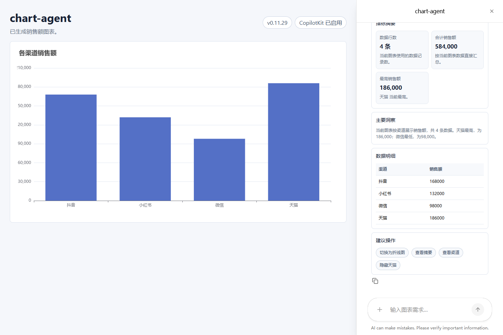
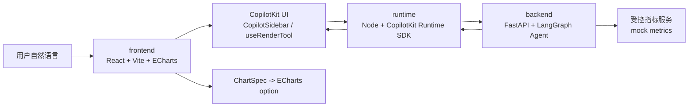

# chart-agent

`chart-agent` 是一个对话式图表 Agent 项目。用户通过自然语言描述分析需求，系统由后端 Agent 决策并生成受控图表动作，前端校验后渲染为 ECharts 图表，同时通过 CopilotKit 提供聊天入口、上下文传递和生成式 UI 展示。

当前项目重点不是让大模型直接生成 React 代码，而是探索一种更可控的方式：**后端生成结构化协议，前端只渲染白名单能力**。



## 项目亮点

- 自然语言生成图表：例如“近 30 天各渠道销售额”。
- 上下文连续编辑：例如“把微信改成红色”“不要显示天猫”。
- 当前图表问答：例如“有哪些渠道？”“抖音销售额是多少？”。
- 受控生成式 UI：通过 `uiBlocks` 渲染指标摘要、洞察卡片、数据明细和建议操作。
- CopilotKit 原生聊天入口：统一使用 `CopilotSidebar`，不额外维护普通聊天框。
- 后端 Agent 主导业务决策：LLM 结果必须经过后端校验和 fallback。

## 架构概览



三层职责边界：

```text
frontend/  图表状态、ECharts 渲染、CopilotKit 前端组件、受控 UI Blocks 渲染
runtime/   CopilotKit Runtime 协议入口、上下文转发、AG-UI 工具事件
backend/   意图决策、数据需求解析、指标查询、ChartAgentAction 生成与校验
```

## 核心边界

- `ChartAgentAction` 是图表状态变更的唯一协议。
- `uiBlocks` 只负责展示洞察、摘要、建议操作和辅助数据，不直接修改图表。
- 前端不注册业务型 `useFrontendTool`，避免出现前后端两套执行通道。
- 大模型不直接生成 React 组件、HTML、任意 ECharts option 或 SQL。
- 每轮请求都携带当前图表上下文，支持连续问答和连续编辑。

## 技术栈

- 前端：React、Vite、TypeScript、ECharts、CopilotKit React UI
- Runtime：Node.js、Express、官方 CopilotKit Runtime SDK
- 后端：FastAPI、LangGraph、Pydantic
- 测试：pytest、Node test runner、Playwright
- LLM：兼容 OpenAI API 的服务，可通过环境变量开启；本地默认关闭以保证稳定验证

## 本地启动

准备环境变量：

```powershell
Copy-Item backend/.env.example backend/.env
Copy-Item frontend/.env.example frontend/.env
```

默认稳定模式启动，`CHART_AGENT_LLM_MODE=off`：

```powershell
powershell -ExecutionPolicy Bypass -File scripts/dev.ps1
```

真实大模型模式启动：

```powershell
powershell -ExecutionPolicy Bypass -File scripts/dev.ps1 -LlmMode openai
```

停止服务：

```powershell
powershell -ExecutionPolicy Bypass -File scripts/stop-dev.ps1
```

默认服务：

```text
frontend  http://127.0.0.1:5184
backend   http://127.0.0.1:8004
runtime   http://127.0.0.1:8014
```

详细说明见 [本地开发指南](docs/local-development.md)。

## 演示流程

可以按下面顺序验证核心能力：

1. 输入“近 30 天各渠道销售额”，生成渠道销售额图表。
2. 继续问“有哪些渠道？”，系统应基于当前图表回答，不重新生成图表。
3. 继续问“抖音销售额是多少？”，系统应读取当前图表数据回答。
4. 输入“把微信改成红色，天猫改成绿色”，系统应修改对应渠道样式。
5. 输入“不要显示天猫”，系统应隐藏对应渠道，而不是回答销售额。
6. 图表生成后，对话内应展示受控生成式 UI 卡片，例如指标摘要、洞察、建议操作和数据明细。

## 测试

后端：

```powershell
cd backend
python -m pytest -q
```

Runtime：

```powershell
cd runtime
npm.cmd run test
npm.cmd run build
npm.cmd run check:text
```

前端：

```powershell
cd frontend
npm.cmd run build
npm.cmd run test:e2e
```

## 文档索引

- [架构说明](docs/architecture.md)
- [受控生成式 UI 设计](docs/generative-ui-design.md)
- [进度与工具事件协议](docs/progress-protocol.md)
- [后端工程规范](docs/backend-engineering-guidelines.md)
- [前端工程规范](docs/frontend-engineering-guidelines.md)
- [测试规范](docs/testing-guidelines.md)
- [项目路线图](docs/roadmap.md)
- [真实数据源接入设计](docs/real-data-source-design.md)
- [代码质量评估](docs/code-quality-assessment.md)
- [公开展示检查清单](docs/public-showcase-checklist.md)
- [更新日志](CHANGELOG.md)
- [Agent 协作规则](AGENTS.md)

内部演进、PoC 和合并检查类文档放在 [docs/internal](docs/internal/)。

## 当前状态

项目仍处于原型到可展示阶段之间，已经具备完整三服务链路、受控协议、基础图表生成编辑、当前图表问答和受控生成式 UI 卡片。当前数据源仍是 mock 指标服务，暂未接入真实业务数据库。

暂不包含：

- 多图 dashboard
- 图表持久化和分享
- 用户登录与权限系统
- 真实指标平台或真实数据库查询
- 生产级部署脚本
- 完整 CI/CD

## 公开说明

本仓库适合用于展示对话式图表 Agent、CopilotKit Runtime 接入、后端 Agent 决策和受控生成式 UI 的实现思路。当前暂未添加 `LICENSE`，公开后默认仅作为展示和学习参考；如需允许复用、分发或商用，需要先明确许可证。

正式公开前建议确认 GitHub 仓库可见性、默认分支、README 展示效果、部署说明和真实密钥清理情况。
